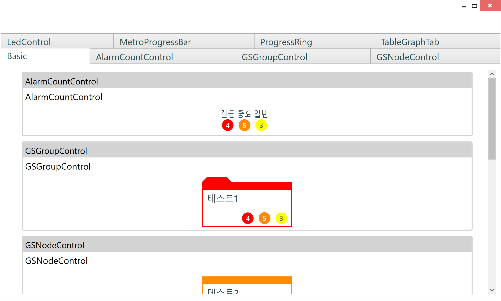

# NCube 2.0

## Summary

NCube에 적용된 테마를 일부 Customize하게 사용하려 할 때, 필요한 방법입니다.

## Getting Started

이 예제는 NCube.Sample.Control을 기준으로 설명합니다.


요구사항 : 기본 폰트가 작게 느껴졌습니다. 이를 크게 만들고 싶습니다.

- 먼저 커스텀 ResourceDictionary를 만듭니다. 프로젝트 아래에, `Custom.xaml`라는 이름으로 ResourceDictionary를 생성합니다.

- 변경할 키 값을 알아야 합니다. NCube의 기본 폰트의 리소스 키는 `NCube.NormalFontSize`입니다. 이는 `NCube.Themes.FlatWhite`프로젝트 아래, `NCube.Control.FlatWhite.FontSize.xaml` 에서 확인할 수 있습니다..

```xml
<ResourceDictionary xmlns="http://schemas.microsoft.com/winfx/2006/xaml/presentation"
                    xmlns:x="http://schemas.microsoft.com/winfx/2006/xaml"
                    xmlns:system="clr-namespace:System;assembly=mscorlib"
                    xmlns:dxg="http://schemas.devexpress.com/winfx/2008/xaml/grid"
                    xmlns:dxe="http://schemas.devexpress.com/winfx/2008/xaml/editors">
  <!--Font Style -->
  <FontFamily x:Key="NCube.GlobalFont">Segoe UI</FontFamily>

  <system:Double x:Key="NCube.PrintFontSize">8</system:Double>
  <system:Double x:Key="NCube.SmallFontSize">11</system:Double>
  <system:Double x:Key="NCube.NormalFontSize">12</system:Double>
  <system:Double x:Key="NCube.ButtonFontSize">13</system:Double>
  <system:Double x:Key="NCube.MenuFontSize">14</system:Double>
  <system:Double x:Key="NCube.SubTitleFontSize">15</system:Double>
  <system:Double x:Key="NCube.LargeFontSize">17</system:Double>
  <system:Double x:Key="NCube.ProgramTitleFontSize">30</system:Double>
  <system:Double x:Key="NCube.TopologyItemFontSize">20</system:Double>
  <system:Double x:Key="NCube.LoginTitleFontSize">40</system:Double>


  <Style TargetType="{x:Type Control}" x:Key="NCube.ControlFontStyle">
    <Setter Property="FontFamily" Value="{StaticResource NCube.GlobalFont}" />
    <Setter Property="Foreground" Value="{DynamicResource NCube.GlobalTextBrush}" />
    <Setter Property="FontSize" Value="{StaticResource NCube.NormalFontSize}" />
  </Style>

  <Style TargetType="{x:Type ComboBox}" BasedOn="{StaticResource NCube.ControlFontStyle}" />
  <Style TargetType="{x:Type CheckBox}" BasedOn="{StaticResource NCube.ControlFontStyle}" />
  <Style TargetType="{x:Type RadioButton}" BasedOn="{StaticResource NCube.ControlFontStyle}" />
  <Style TargetType="{x:Type dxe:TextEdit}" BasedOn="{StaticResource NCube.ControlFontStyle}" />
  <Style TargetType="{x:Type dxe:ComboBoxEdit}" BasedOn="{StaticResource NCube.ControlFontStyle}" />
  <Style TargetType="{x:Type dxg:TreeListControl}" BasedOn="{StaticResource NCube.ControlFontStyle}" />
  <Style TargetType="{x:Type dxg:GridControl}" BasedOn="{StaticResource NCube.ControlFontStyle}" />
</ResourceDictionary>
``` 

- `Custom.xaml` 안에 `NCube.NormalFontSize` 키 값을 추가해줍니다. 기존 값은 `12`였으나, `18`로 변경하기로 합니다.

```xml
<ResourceDictionary xmlns="http://schemas.microsoft.com/winfx/2006/xaml/presentation"
                    xmlns:x="http://schemas.microsoft.com/winfx/2006/xaml"
                    xmlns:system="clr-namespace:System;assembly=mscorlib">
  <system:Double x:Key="NCube.NormalFontSize">18</system:Double>
</ResourceDictionary>
```

- `NCubeStartup`을 구성하셨다면, 아래와 같이 `UseCustomTheme` 코드를 추가해줍니다. 

```cs
using GalaSoft.MvvmLight.Ioc;
using Microsoft.Practices.ServiceLocation;
using NCube.Builder;
using NCube.Services.Alarms;

namespace NCube.Sample.Controls
{
    public class AppStartup : NCubeStartup
    {
        public override void Build(NCubeBuilder builder)
        {
            builder.UseTheme(NCubeThemeSelector.FlatWhite);
            // 아래 코드 추가
            builder.UseCustomTheme("Custom.xaml");

            ServiceLocator.SetLocatorProvider(() => SimpleIoc.Default);
            SimpleIoc.Default.Register<IAlarmSeverityMethods, DefaultAlarmSeverityMethods>();
        }
    }
}
```

- App.xaml에 넣는 방식을 사용하셨다면, 아래와 같이 구성합니다.

```xml
<Application x:Class="NCube.Sample.Controls.App"
             xmlns="http://schemas.microsoft.com/winfx/2006/xaml/presentation"
             xmlns:x="http://schemas.microsoft.com/winfx/2006/xaml"
             xmlns:d="http://schemas.microsoft.com/expression/blend/2008" 
             mc:Ignorable="d" xmlns:mc="http://schemas.openxmlformats.org/markup-compatibility/2006">
  <Application.Resources>
    <ResourceDictionary>
      <ResourceDictionary.MergedDictionaries>
        <ResourceDictionary Source="pack://application:,,,/NCube.Themes.FlatWhite.v2.0;component/Themes/Generic.xaml" />
        <ResourceDictionary Source="pack://application:,,,/NCube.v2.0;component/ControlResources/Generic.xaml" />
        <ResourceDictionary Source="Custom.xaml"></ResourceDictionary>
      </ResourceDictionary.MergedDictionaries>
    </ResourceDictionary>
  </Application.Resources>
</Application>
```

- 기본 폰트가 변경된 것을 볼 수 있습니다.

