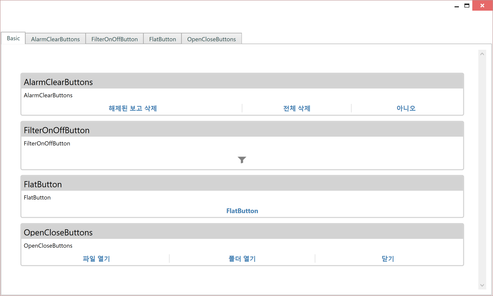
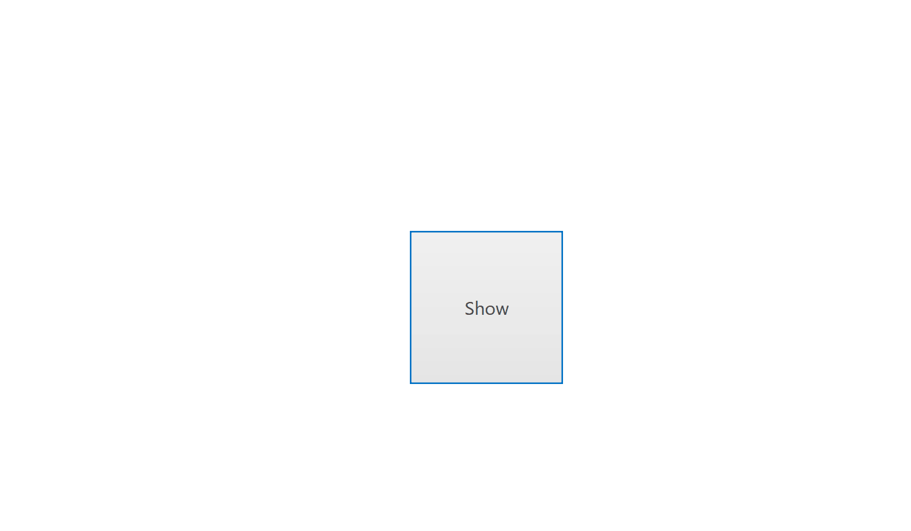
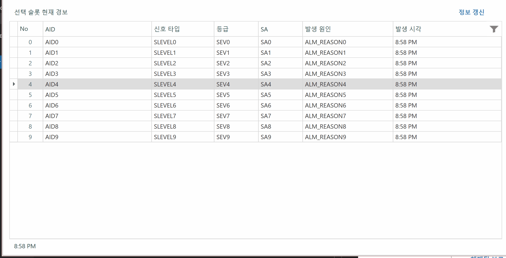
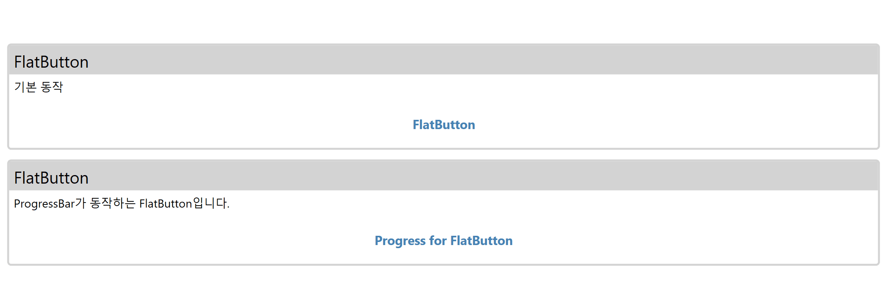
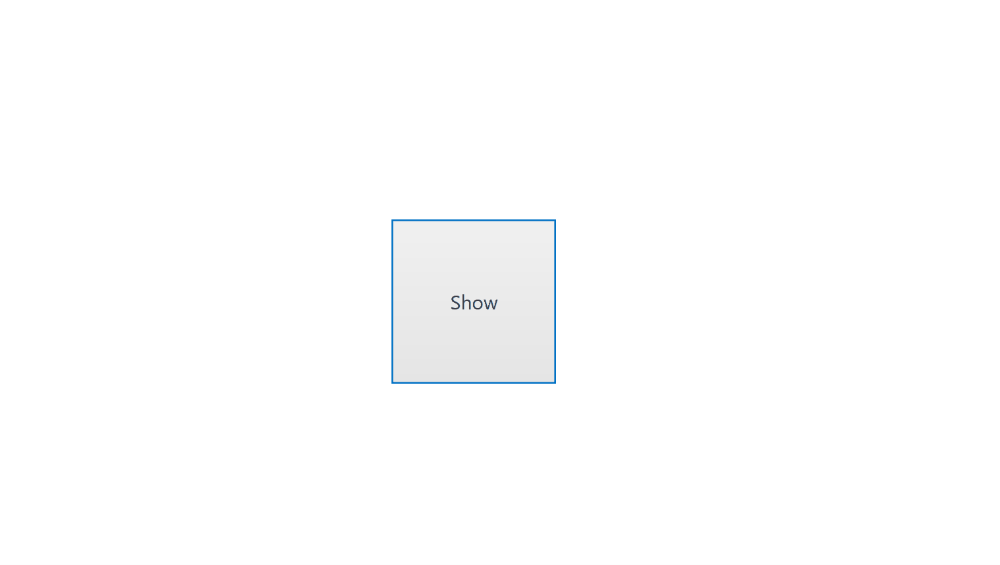

# Summary

- Panel 내에 삽입하여 쓰는 버튼입니다.



# AlarmClearButtons

### 컨트롤 목적

- 자동보고 창을 컨트롤 하기 위한 버튼 컨트롤입니다.



### 샘플 코드

```xml
<Button Content="Show" Click="ButtonBase_OnClick" Width="100" Height="100"/>
``` 

```cs
private void ButtonBase_OnClick(object sender, RoutedEventArgs e)
{
    var btns = new AlarmClearButtons();
    btns.ClickClearRls += (_, __) => MessageBox.Show("ClickClearRls");
    btns.ClickClearAll += (_, __) => MessageBox.Show("ClickClearAll");

    var content = new MsgBoxPopupPageView()
    {
        MsgStr = "자동 보고 리스트를 삭제하시겠습니까?",
        MsgIcon = MessageBoxImage.Question,
        MsgButton = MsgBoxButton.Custom,
        CustomButtons = btns
    };

    var d = new FlatPopup()
    {
        Content = content
    };
    d.ShowDialog();
}
```


# FilterOnOffButton

### 컨트롤 목적

- GridControl의 필터를 켜고 끌때 사용하는 버튼입니다.



### 샘플 코드

```xml
<dxg:GridControl x:Name="GC_Alm" ItemsSource="{Binding SysAlmItems}" Margin="0">
    <dxg:GridControl.Columns >
        <!-- Columns가 추가됨 -->
        <dxg:GridColumn .../>
    </dxg:GridControl.Columns>
</dxg:GridControl>

<buttons:FilterOnOffButton VerticalAlignment="Top" HorizontalAlignment="Right" Click="BTN_AlmFilter_Click"/>
```

```cs
private void BTN_AlmFilter_Click(object sender, RoutedEventArgs e)
{
    var gc_view = GC_Alm.View as TableView;
    gc_view.ShowAutoFilterRow = !gc_view.ShowAutoFilterRow;
    if (!gc_view.ShowAutoFilterRow)
    {
        GC_Alm.FilterString = "";
    }
}
```


# FlatButton

### 컨트롤 목적

- FlatButton 입니다. Progress를 이용하여 동작시킬 수 있습니다.



### 샘플 코드

```xml
<buttons:FlatButton Width="200" Height="40"
                            Click="FlatButton_OnClick" Content="FlatButton" />
<buttons:FlatButton Width="200" Height="40"
                            Click="FlatButton_OnClickProgressBar" Content="Progress for FlatButton" />
```

```cs
private void FlatButton_OnClick(object sender, RoutedEventArgs e)
{
    MessagePopup.ShowOK("버튼 클릭");
}

private void FlatButton_OnClickProgressBar(object sender, RoutedEventArgs e)
{
    var button = sender as FlatButton;

    if (button.Status == FlatButton.ControlStatus.Normal)
    {
        button.Status = FlatButton.ControlStatus.Processing;
        button.ProgressValue = 0;
        Task.Run(async () =>
        {
            for (int idx = 0; idx < 25; idx++)
            {
                await Task.Delay(30);
                Dispatcher.Invoke(() => { button.ProgressValue += 4; });
            }
            Dispatcher.Invoke(() =>
            {
                MessagePopup.ShowOK("완료");
            });
        });
    }
    else
    {
        button.Status = FlatButton.ControlStatus.Normal;
    }
}
```


# OpenCloseButtons

### 컨트롤 목적

- 파일을 여는 버튼입니다. filePath를 지정하여, 해당 파일의 폴더나 파일을 열고 닫을 수 있습니다.



### 샘플 코드

```xml
<Button Content="Show" Click="ButtonBase_OnClick" Width="100" Height="100"/>
```

```cs
private void ButtonBase_OnClick(object sender, RoutedEventArgs e)
{
    var filePath = @"Z:\NCube\source2.0\README.md";
    var openClose = new OpenCloseButtons()
    {
        FilePath = filePath
    };


    var content = new MsgBoxPopupPageView()
    {
        MsgStr = $"{filePath}를 여시겠습니까?",
        MsgIcon = MessageBoxImage.Question,
        MsgButton = MsgBoxButton.Custom,
        CustomButtons = openClose
    };

    var d = new FlatPopup()
    {
        Content = content
    };
    d.ShowDialog();
}
```