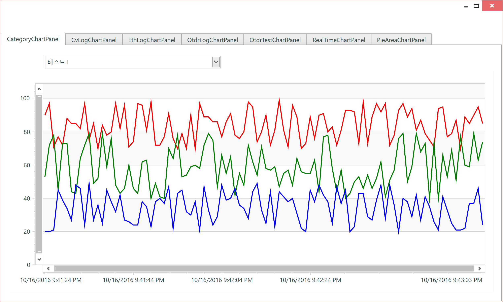
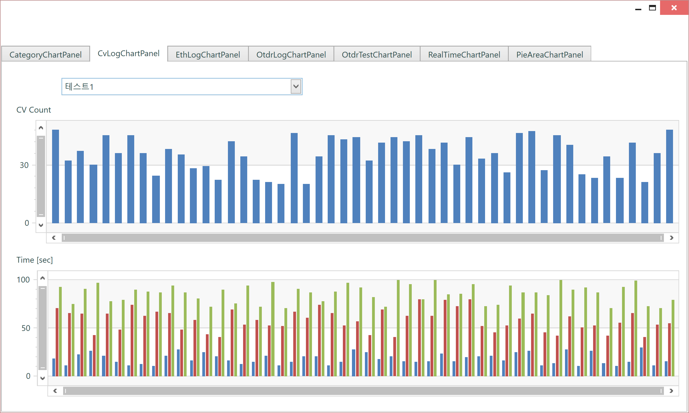
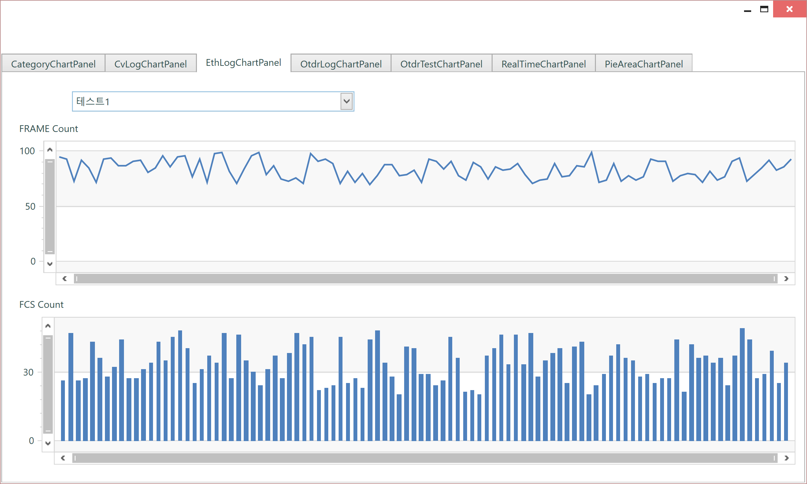
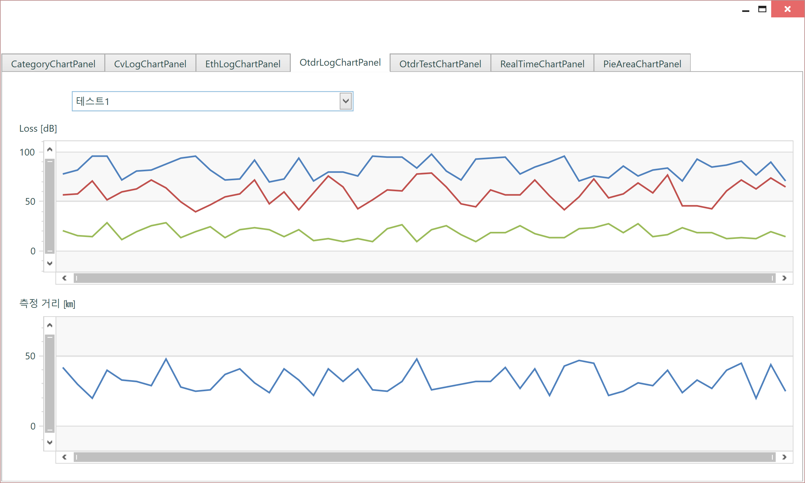
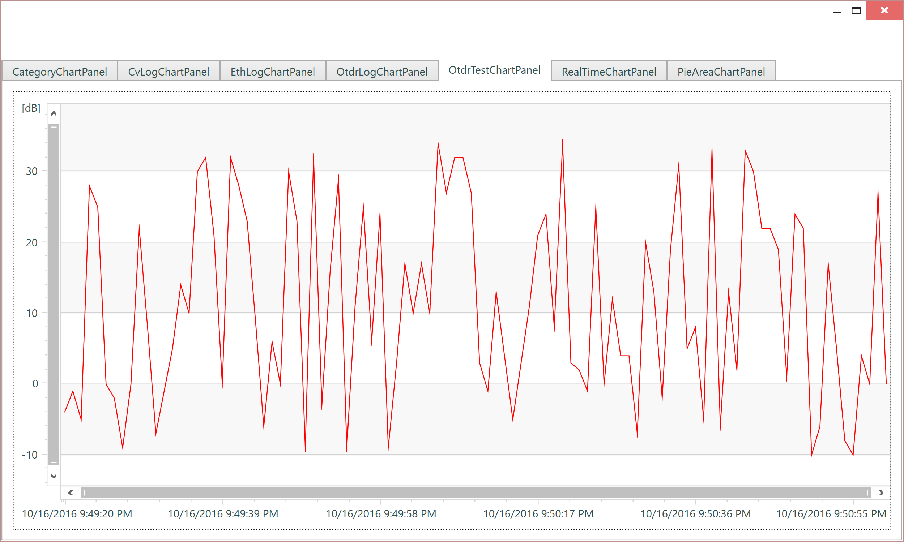
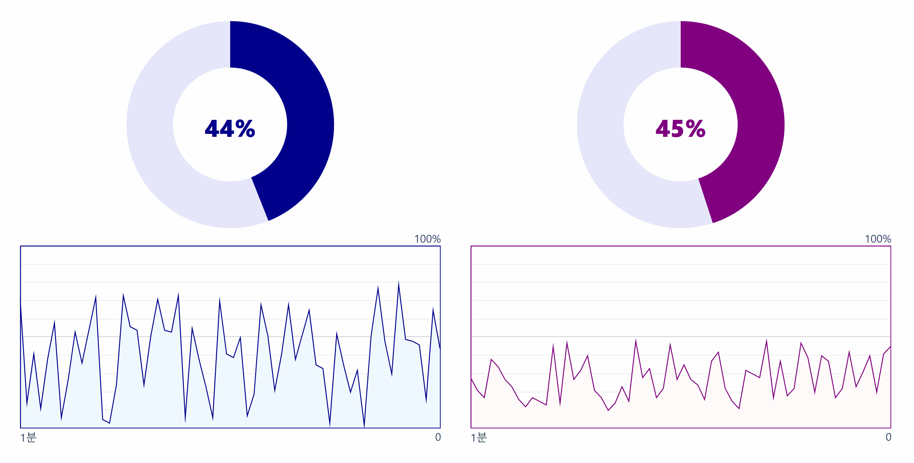

# Summary

- 

# CategoryChartControl

### 컨트롤 목적

- 카테고리 형식으로 차트를 보여줍니다. Max, Avg, Min 각각 색 설정할 수도 있습니다.



### 샘플 코드

```xml
<charts:CategoryChartControl x:Name="chart"
                                 AverageValueBrush="Green" MaxValueBrush="Red" MinValueBrush="Blue" />
``` 

```cs
chart.Items = new ObservableCollection<CategoryChartModel>();

private void InitItems()
{
    var ram = new Random();
    for (int count = 1; count <= 2; count++)
    {
        var maxPoints = new List<SeriesPoint>();
        var avrPoints = new List<SeriesPoint>();
        var minPoints = new List<SeriesPoint>();

        var now = DateTime.Now;
        for (int idx = 0; idx < 100; idx++)
        {
            var nowDate = now + new TimeSpan(0, 0, idx);
            var nowStr = nowDate.ToString();
            int max = ram.Next(70, 100);
            maxPoints.Add(new BaseChartSeriesPoint(nowDate, max, nowStr, max));
            int avr = ram.Next(40, 80);
            avrPoints.Add(new BaseChartSeriesPoint(nowDate, avr, nowStr, avr));
            int min = ram.Next(20, 50);
            minPoints.Add(new BaseChartSeriesPoint(nowDate, min, nowStr, min));
        }
        var category = new CategoryChartModel("테스트" + count, maxPoints, avrPoints, minPoints);
        chart.Items.Add(category);
    }
}
```


# CvLogChartControl

### 컨트롤 목적

- CvLog를 보여주기 위한 차트입니다.



### 샘플 코드

```xml
<charts:CvLogChartControl x:Name="chart" />
``` 

```cs
chart.Items = new ObservableCollection<CvLogChartModel>();

private void InitItems()
{
    var ram = new Random();
    for (int count = 1; count <= 2; count++)
    {
        var maxPoints = new List<SeriesPoint>();
        var avrPoints = new List<SeriesPoint>();
        var minPoints = new List<SeriesPoint>();
        var esPoints = new List<SeriesPoint>();

        var now = DateTime.Now;
        for (int idx = 0; idx < 50; idx++)
        {
            var nowDate = now + new TimeSpan(0, 0, idx);
            var nowStr = nowDate.ToString();
            int max = ram.Next(70, 100);
            maxPoints.Add(new BaseChartSeriesPoint(nowDate, max, nowStr, max));
            int avr = ram.Next(40, 80);
            avrPoints.Add(new BaseChartSeriesPoint(nowDate, avr, nowStr, avr));
            int min = ram.Next(20, 50);
            minPoints.Add(new BaseChartSeriesPoint(nowDate, min, nowStr, min));
            int es = ram.Next(10, 30);
            esPoints.Add(new BaseChartSeriesPoint(nowDate, es, nowStr, es));
        }

        var category = new CvLogChartModel("테스트" + count, maxPoints, avrPoints, minPoints, esPoints);
        chart.Items.Add(category);
    }
}
```


# EthLogChartControl

### 컨트롤 목적

- EthLog를 보여주기 위한 차트입니다.



### 샘플 코드

```xml
chart.Items = new ObservableCollection<EthLogChartModel>();
``` 

```cs
chart.Items = new ObservableCollection<EthLogChartModel>();

private void InitItems()
{
    var ram = new Random();
    for (int count = 1; count <= 2; count++)
    {
        var maxPoints = new List<SeriesPoint>();
        var avrPoints = new List<SeriesPoint>();
        var minPoints = new List<SeriesPoint>();

        var now = DateTime.Now;
        for (int idx = 0; idx < 100; idx++)
        {
            var nowDate = now + new TimeSpan(0, 0, idx);
            var nowStr = nowDate.ToString();
            int max = ram.Next(70, 100);
            maxPoints.Add(new BaseChartSeriesPoint(nowDate, max, nowStr, max));
            int avr = ram.Next(40, 80);
            avrPoints.Add(new BaseChartSeriesPoint(nowDate, avr, nowStr, avr));
            int min = ram.Next(20, 50);
            minPoints.Add(new BaseChartSeriesPoint(nowDate, min, nowStr, min));
        }

        var category = new EthLogChartModel("테스트" + count, maxPoints, minPoints);
        chart.Items.Add(category);
    }
}
```


# OtdrLogChartControl

### 컨트롤 목적

- Otdr Log를 보여주기 위한 차트입니다.



### 샘플 코드

```xml
<charts:OtdrLogChartControl x:Name="chart" />
``` 

```cs
chart.Items = new ObservableCollection<OtdrChartModel>();

private void InitItems()
{
    var ram = new Random();
    for (int count = 1; count <= 2; count++)
    {
        var maxPoints = new List<SeriesPoint>();
        var avrPoints = new List<SeriesPoint>();
        var minPoints = new List<SeriesPoint>();
        var esPoints = new List<SeriesPoint>();

        var now = DateTime.Now;
        for (int idx = 0; idx < 50; idx++)
        {
            var nowDate = now + new TimeSpan(0, 0, idx);
            var nowStr = nowDate.ToString();
            int max = ram.Next(70, 100);
            maxPoints.Add(new BaseChartSeriesPoint(nowDate, max, nowStr, max));
            int avr = ram.Next(40, 80);
            avrPoints.Add(new BaseChartSeriesPoint(nowDate, avr, nowStr, avr));
            int min = ram.Next(20, 50);
            minPoints.Add(new BaseChartSeriesPoint(nowDate, min, nowStr, min));
            int es = ram.Next(10, 30);
            esPoints.Add(new BaseChartSeriesPoint(nowDate, es, nowStr, es));
        }

        var category = new OtdrChartModel("테스트" + count, maxPoints, avrPoints, minPoints, esPoints);
        chart.Items.Add(category);
    }
}
```


# OtdrTestChartControl

### 컨트롤 목적

- Otdr Test Log를 보여주기 위한 차트입니다.



### 샘플 코드

```xml
<charts:OtdrTestChartControl x:Name="chart" BendValueBrush="Red" />
``` 

```cs
chart.Items = new ObservableCollection<OtdrChartModel>();

private void InitItems()
{
    var ram = new Random();
    for (int count = 1; count <= 1; count++)
    {
        var maxPoints = new List<SeriesPoint>();

        var now = DateTime.Now;
        for (int idx = 0; idx < 100; idx++)
        {
            var nowDate = now + new TimeSpan(0, 0, idx);
            var nowStr = nowDate.ToString();
            int max = ram.Next(-10, 35);
            maxPoints.Add(new BaseChartSeriesPoint(nowDate, max, nowStr, max));
        }

        var category = new OtdrChartModel("테스트" + count, maxPoints, null, null, null);
        chart.Items.Add(category);
    }
}
```


# PieAreaChart

### 컨트롤 목적

- CPU 및 메모리를 표현하기 위한 파이차트입니다.



### 샘플 코드

```xml
<chart:PieAreaChart x:Name="chart1"
                    Grid.Column="0"
                    Margin="10"
                    AreaData="{Binding Path=CpuRecords}"
                    CurrentUsage="{Binding Path=CpuUsage}"
                    IsTooltipEnabled="False"
                    LightColor="{DynamicResource NCube.PieAreaChartCpuLightColor}"
                    MaxTimeTitle="{Binding Path=MaxTimeTitle}"
                    NormalColor="{DynamicResource NCube.PieAreaChartCpuNormalColor}"
                    PieData="{Binding Path=CpuPieData}"
                    XMaxValue="{Binding Path=XMaxValue}"
                    XMinValue="{Binding Path=XMinValue}" />
<chart:PieAreaChart x:Name="chart2"
                    Grid.Column="1"
                    Margin="10"
                    AreaData="{Binding Path=MemoryRecords}"
                    CurrentUsage="{Binding Path=MemoryUsage}"
                    IsTooltipEnabled="True"
                    LightColor="{DynamicResource NCube.PieAreaChartMemoryLightColor}"
                    MaxTimeTitle="{Binding Path=MaxTimeTitle}"
                    NormalColor="{DynamicResource NCube.PieAreaChartMemoryNormalColor}"
                    PieData="{Binding Path=MemoryPieData}"
                    TooltipAvailable="{Binding Path=MemoryAvailable}"
                    TooltipInUse="{Binding Path=MemoryInUse}"
                    TooltipTotal="{Binding Path=MemoryTotal}"
                    XMaxValue="{Binding Path=XMaxValue}"
                    XMinValue="{Binding Path=XMinValue}" />
``` 

```cs
DataContext = new PieAreaChartPanelViewModel();

// ...
// 예제의 PieAreaChartPanelViewModel.cs 를 참고하세요.
```


# RealTimeChartControl

##### 컨트롤 목적

- 실시간 차트를 표현합니다.
- Threshold를 설정할 수 있습니다.
- 각 Series의 색을 지정할 수 있습니다.
- Sereis 표현을 Line, Area 로 표현가능합니다.


##### 샘플 코드
```xaml
<charts:RealTimeChartControl x:Name="chart1"
                                AlwaysShowZeroLevel="True" AverageValueBrush="Green" MaxValueBrush="Red" MinValueBrush="Blue"
                                ThresholdMaxBrush="Orange" ThresholdMaxValue="50" ThresholdMinBrush="Orange" ThresholdMinValue="20"
                                ThresholdViewType="MaxAndMin" ValueViewType="Line" />
<charts:RealTimeChartControl x:Name="chart2"
                                AverageValueBrush="Green" SeriesCount="50" ValueViewType="SingleArea" />
<charts:RealTimeChartControl x:Name="chart3"
                                AverageValueBrush="Green" SeriesCount="200" ThresholdViewType="None" ValueViewType="SingleLine" />
``` 

```cs
private async void ItemsInit()
{
    chart1.Items = new ObservableCollection<RealTimeChartModel>();
    chart2.Items = new ObservableCollection<RealTimeChartModel>();
    chart3.Items = new ObservableCollection<RealTimeChartModel>();

    chart1.CustomCrosshairTextAction = data =>
        String.Format("{0:F2} % ({1:F1} {2}bps)",
        data.ActualValue.Value,
        data.ActualValue.Value > 1 ? data.ActualValue.Value * 10 : data.ActualValue.Value * 10000,
        data.ActualValue.Value > 1 ? "M" : "K");
    chart2.CustomCrosshairTextAction = chart3.CustomCrosshairTextAction = chart1.CustomCrosshairTextAction;

    chart1.HighBiasValue = 60;
    chart2.HighBiasValue = 60;
    chart3.HighBiasValue = 60;
    chart1.LowBiasValue = 40;
    chart2.LowBiasValue = 40;
    chart3.LowBiasValue = 40;

    var ram = new Random();
    var now = DateTime.Now;

    int idx = 0;
    while (true)
    {
        await Task.Delay(2000);
        chart1.Items.Add(NewItem(now, idx, ram));
        chart2.Items.Add(NewItem(now, idx, ram));
        chart3.Items.Add(NewItem(now, idx, ram));
        idx++;
    }
}
```
