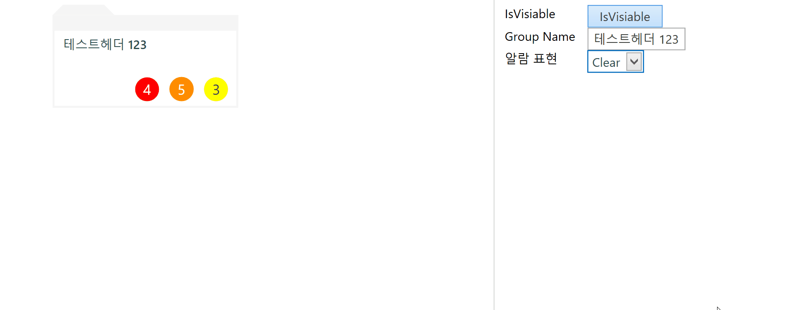
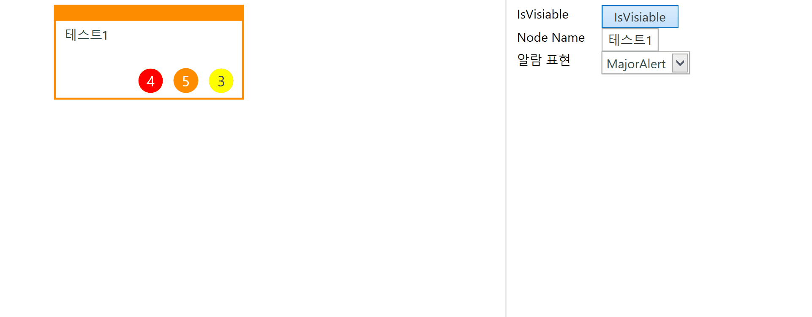
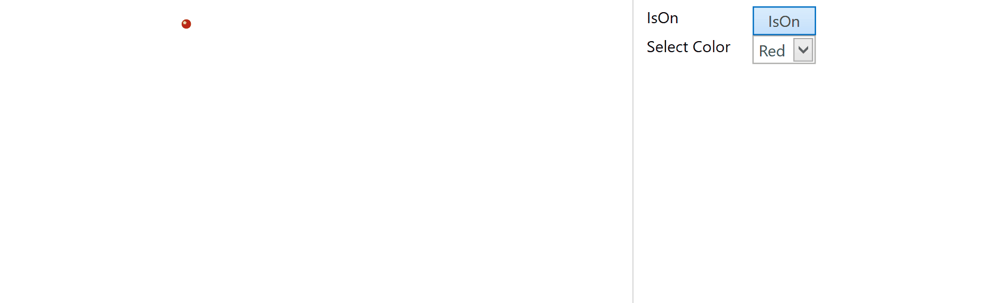
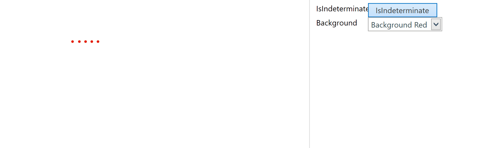
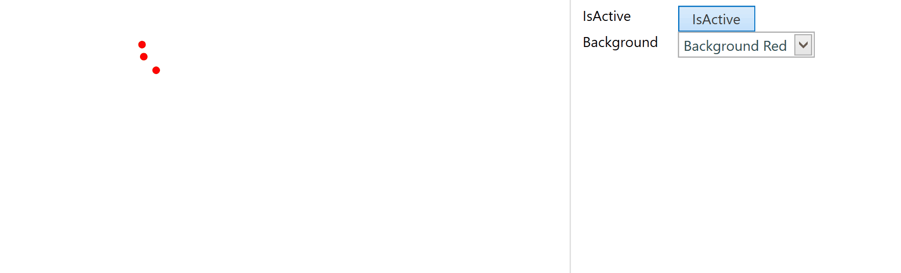

# Summary

- 


# AlarmCountControl

### 컨트롤 목적

- 


### 샘플 코드

```xml
<nvctrl:AlarmCountControl Width="100" Height="50"
                              CriticalAlarmCount="4" MajorAlarmCount="5" MinorAlarmCount="3" Margin="20" IsHeaderVisiable="{Binding IsChecked, ElementName=TBTN_IsHeaderVisiable}"/>
``` 


# GSGroupControl

### 컨트롤 목적

- 



### 샘플 코드

```xml
<nvctrl:GSGroupControl Margin="10"
                               AlarmStatus="{Binding SelectedItem.Tag, ElementName=CB_AlarmStatusType}"
                               CriticalAlarmCount="4"
                               GroupName="{Binding Text, ElementName=TB_GroupName}"
                               IsVisiable="{Binding IsChecked, ElementName=TBTN_IsHeaderVisiable}"
                               MajorAlarmCount="5" MinorAlarmCount="3" />
``` 


# GSNodeControl

### 컨트롤 목적

- 



### 샘플 코드

```xml
<nvctrl:GSNodeControl AlarmStatus="{Binding SelectedItem.Tag, ElementName=CB_AlarmStatusType}"
                            CriticalAlarmCount="4"
                            IsVisiable="{Binding IsChecked, ElementName=TBTN_IsHeaderVisiable}"
                            MajorAlarmCount="5" MinorAlarmCount="3"
                            NodeName="{Binding Text, ElementName=TB_NodeName}" />
``` 


# LedControl

### 컨트롤 목적

- 



### 샘플 코드

```xml
<nvctrl:LedControl IsON="{Binding IsChecked, ElementName=TBTN_IsOn}" Color="{Binding SelectedItem.Tag, ElementName=CB_SelectColor}" Margin="20"/>
``` 


# MetroProgressBar

### 컨트롤 목적

- 



### 샘플 코드

```xml
<nvctrl:MetroProgressBar Width="100" Height="100"
                                 Margin="20"
                                 Foreground="{Binding SelectedItem.Tag, ElementName=CB_Background}"
                                 IsIndeterminate="{Binding IsChecked, ElementName=TBTN_IsIndeterminate}" />
``` 


# ProgressRing

### 컨트롤 목적

- 



### 샘플 코드

```xml
<nvctrl:ProgressRing Width="50" Height="50"
                               IsActive="{Binding IsChecked, ElementName=TBTN_IsActive}" Foreground="{Binding SelectedItem.Tag, ElementName=CB_Background}" Margin="20"/>
``` 

# TableGraphTab

### 컨트롤 목적

- 


### 샘플 코드

```xml
<nvctrl:TableGraphTab FindClick="TableGraphTab_OnFindClick" GraphViewSelected="TableGraphTab_OnGraphViewSelected" TableViewSelected="TableGraphTab_OnTableViewSelected" Margin="20"/>
``` 

```cs
private void TableGraphTab_OnTableViewSelected(object sender, EventArgs e)
{
    TB_Show.Text = "OnTableViewSelected";
}

private void TableGraphTab_OnGraphViewSelected(object sender, EventArgs e)
{
    TB_Show.Text = "OnGraphViewSelected";
}

private void TableGraphTab_OnFindClick(object sender, EventArgs e)
{
    TB_Show.Text = "OnFindClick";
}
```