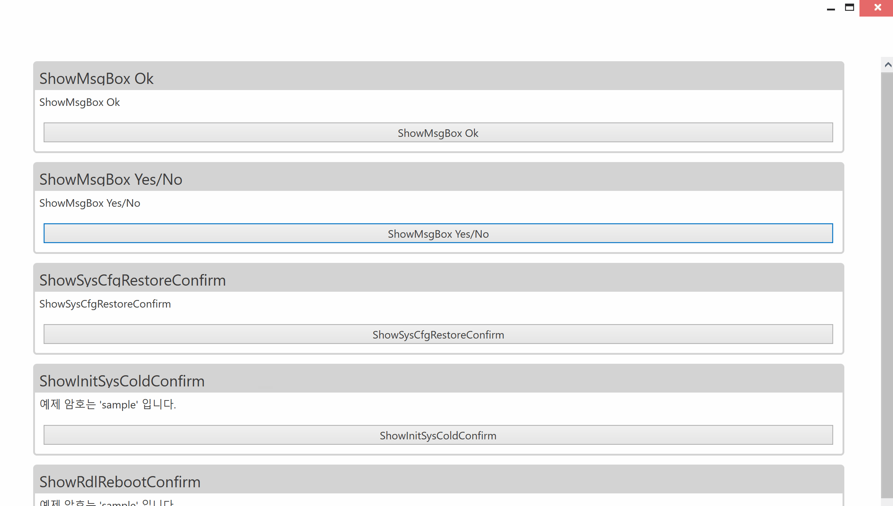
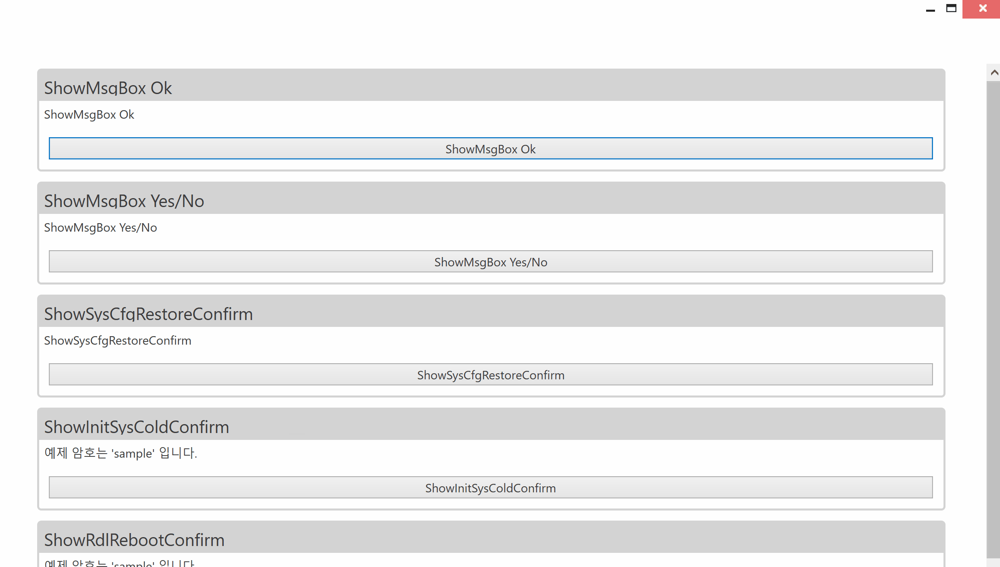
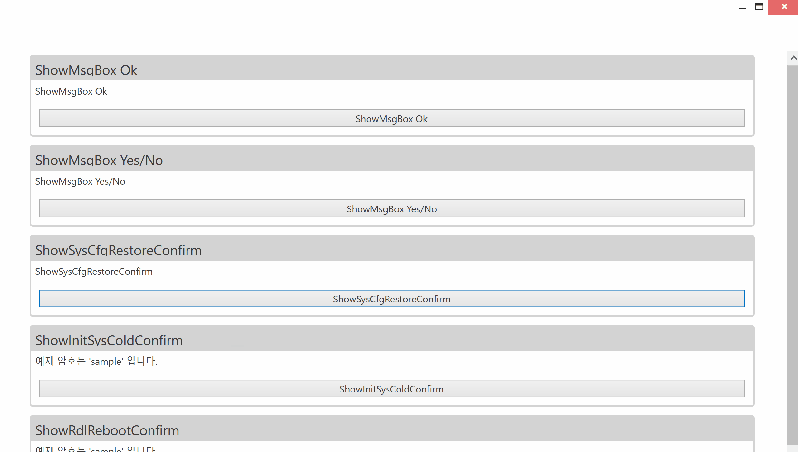
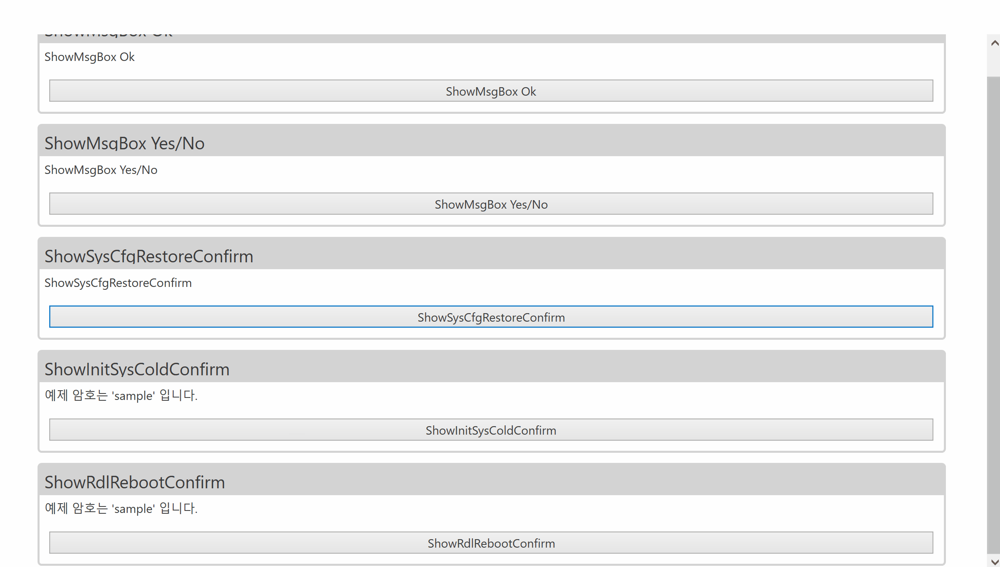
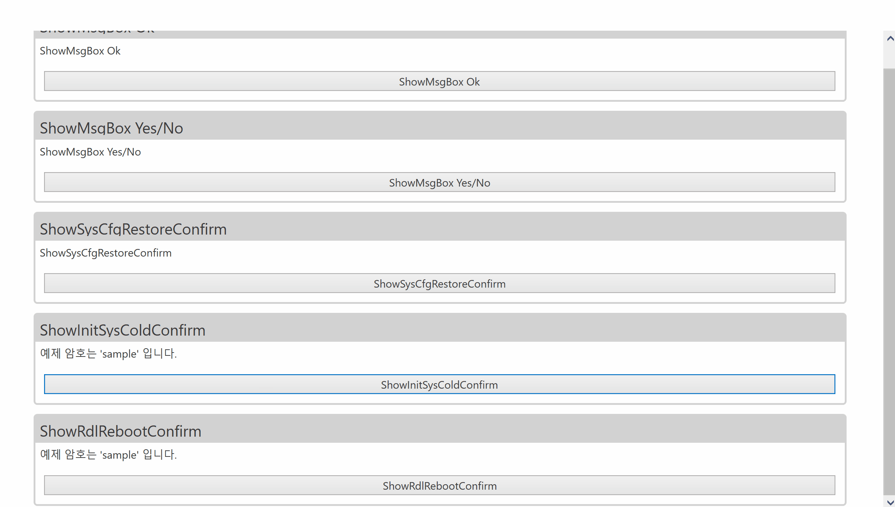

# Summary

- FlatPopup Class를 이용하여 Dialog를 생성합니다.

# FlatPopup

### 컨트롤 목적

- NCube 기본 형태의 Dialog입니다. Content로 필요한 패널을 같이 넣어야 사용할 수 있습니다.

### 샘플 코드

- FlatPopup을 이용하여 메인 Grid를 Lock하고 싶을 시, 아래 코드를 활용해야 합니다.

``` cs
WindowLockHelper.LockedGrid = GRID;
```


# FlatPopup & MsgBoxPopupPageView

### 컨트롤 목적

- FlatPopup & MsgBoxPopupPageView



### 샘플 코드

```xml
<Button Click="ButtonBase_ShowMsgBoxOk" Content="ShowMsgBox Ok" />
``` 

```cs
private void ButtonBase_ShowMsgBoxOk(object sender, RoutedEventArgs e)
{
    MessagePopup.ShowOK("작업이 완료되었습니다.");
}
```


# FlatPopup & MsgBoxPopupPageView 2

### 컨트롤 목적

- FlatPopup & MsgBoxPopupPageView 2



### 샘플 코드

```xml
<Button Click="ButtonBase_ShowMsgBoxYesNo" Content="ShowMsgBox Yes/No" />
``` 

```cs
private void ButtonBase_ShowMsgBoxYesNo(object sender, RoutedEventArgs e)
{
    var result = MessagePopup.ShowYesNo("설정을 수행하시겠습니까?");

    if (result == MessageBoxResult.Yes)
    {
        MessagePopup.ShowOK("완료");
    }
    else
    {
        MessagePopup.ShowSetFailOnly();
    }
}
```


# FlatPopup & SysCfgRestoreConfirmPopupPageView

### 컨트롤 목적

- FlatPopup & SysCfgRestoreConfirmPopupPageView



### 샘플 코드

```xml
<Button Click="ButtonBase_ShowSysCfgRestoreConfirm" Content="ShowSysCfgRestoreConfirm" />
``` 

```cs
private void ButtonBase_ShowSysCfgRestoreConfirm(object sender, RoutedEventArgs e)
{
    var d = new FlatPopup
    {
        Content = new SysCfgRestoreConfirmPopupPageView()
    };
    var result = d.ShowDialog();

    if (result != null && result.Value)
    {
        MessagePopup.ShowOK("완료");
    }
    else
    {
        MessagePopup.ShowSetFailOnly();
    }
}
```


# FlatPopup & InitSysColdConfirmPopupPageView

### 컨트롤 목적

- FlatPopup & InitSysColdConfirmPopupPageView



### 샘플 코드
```xml
<Button Click="ButtonBase_ShowInitSysColdConfirm" Content="ShowInitSysColdConfirm" />
``` 

```cs
ServiceLocator.SetLocatorProvider(() => SimpleIoc.Default);
SimpleIoc.Default.Register<ILoginUserModel, DefaultLoginUserModel>();

var loginUser = ServiceLocator.Current.GetInstance<ILoginUserModel>();
loginUser.Password = "sample";
loginUser.IsLoggedIn = true;

// ...

private void ButtonBase_ShowInitSysColdConfirm(object sender, RoutedEventArgs e)
{
    var d = new FlatPopup
    {
        Content = new InitSysColdConfirmPopupPageView()
    };
    var result = d.ShowDialog();

    if (result != null && result.Value)
    {
        MessagePopup.ShowOK("완료");
    }
    else
    {
        MessagePopup.ShowSetFailOnly();
    }
}
```


# FlatPopup & RdlRebootConfirmPopupPageView

### 컨트롤 목적

- FlatPopup & RdlRebootConfirmPopupPageView



### 샘플 코드

```xml
<Button Click="ButtonBase_ShowRdlRebootConfirm" Content="ShowRdlRebootConfirm" />
``` 

```cs
ServiceLocator.SetLocatorProvider(() => SimpleIoc.Default);
SimpleIoc.Default.Register<ILoginUserModel, DefaultLoginUserModel>();

var loginUser = ServiceLocator.Current.GetInstance<ILoginUserModel>();
loginUser.Password = "sample";
loginUser.IsLoggedIn = true;

// ...

private void ButtonBase_ShowRdlRebootConfirm(object sender, RoutedEventArgs e)
{
    var d = new FlatPopup
    {
        Content = new RdlRebootConfirmPopupPageView()
    };
    var result = d.ShowDialog();

    if (result != null && result.Value)
    {
        MessagePopup.ShowOK("완료");
    }
    else
    {
        MessagePopup.ShowSetFailOnly();
    }
}
```
