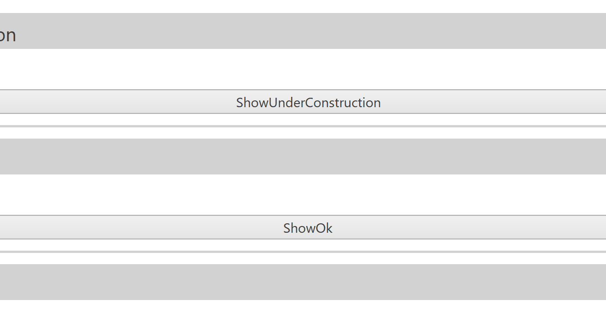
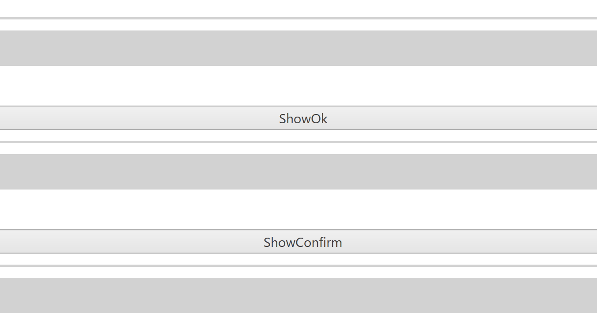
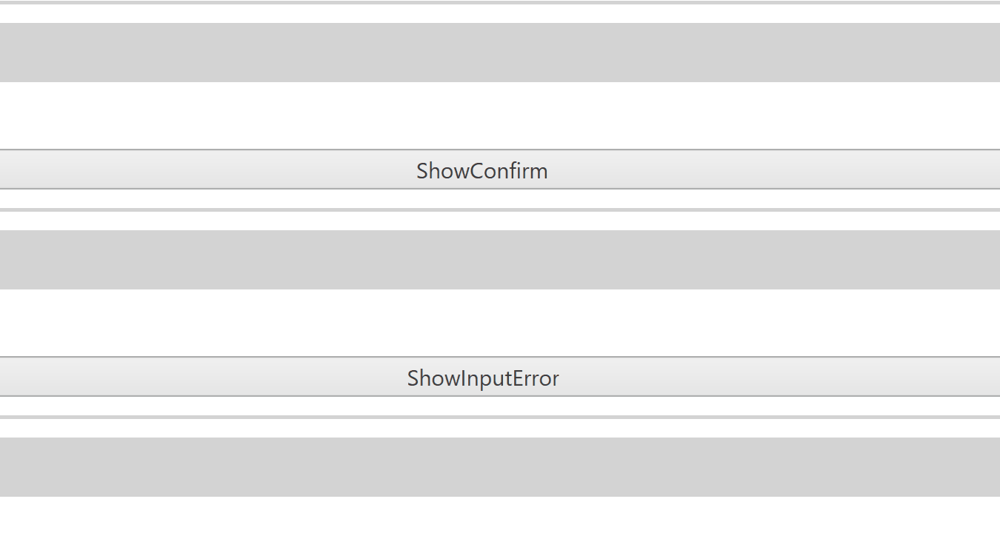
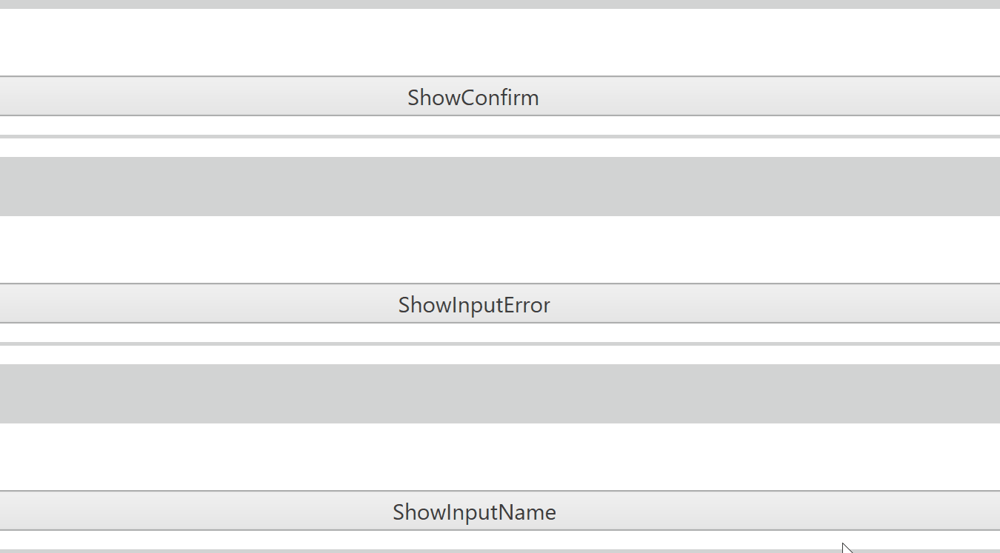
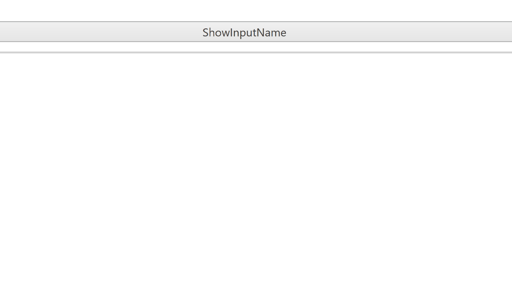

# NCube 2.0

## Summary

### Controls
---
#### Flyout
##### 컨트롤 목적
- 화면 상에 Flyout 형태의 창을 띄웁니다. FlyoutHelper 헬퍼 클래스를 이용하여 사용됩니다.
##### 샘플 코드
- 사용하는 Grid에 아래의 코드를 삽입하여 사용합니다.
```xaml
<dxe:FlyoutControl x:Name="fly" Content="flyout" />
``` 


---
#### ShowUnderConstruction

##### 컨트롤 목적
- 
##### 샘플 코드
```xaml
<Button Click="ButtonBase_OnClick" Content="ShowUnderConstruction" />
``` 
```cs
private void ButtonBase_OnClick(object sender, RoutedEventArgs e)
{
    FlyoutHelper.ShowUnderConstruction(fly, (UIElement)sender);
}
```


---
#### ShowOk

##### 컨트롤 목적
- 
##### 샘플 코드
```xaml
<Button Click="ButtonBase_OnClick2" Content="ShowOk" />
``` 
```cs
private void ButtonBase_OnClick2(object sender, RoutedEventArgs e)
{
    FlyoutHelper.ShowOk(fly, (UIElement)sender, "메세지");
}
```


---
#### ShowConfirm

##### 컨트롤 목적
- 
##### 샘플 코드
```xaml
<Button Click="ButtonBase_OnClick3" Content="ShowConfirm" />
``` 
```cs
private void ButtonBase_OnClick3(object sender, RoutedEventArgs e)
{
    FlyoutHelper.ShowConfirm(fly, (UIElement)sender, () =>
    {
        MessageBox.Show("Ok");
    });
}
```


---
#### ShowInputError

##### 컨트롤 목적
- 
##### 샘플 코드
```xaml
<Button Click="ButtonBase_OnClick4" Content="ShowInputError" />
``` 
```cs
private void ButtonBase_OnClick4(object sender, RoutedEventArgs e)
{
    FlyoutHelper.ShowInputError(fly, (UIElement)sender, "메세지");
}
```


---
#### ShowInputName

##### 컨트롤 목적
- 
##### 샘플 코드
```xaml
<Button Click="ButtonBase_OnClick5" Content="ShowInputName" />
``` 
```cs
private void ButtonBase_OnClick5(object sender, RoutedEventArgs e)
{
    FlyoutHelper.ShowInputName(fly, (UIElement)sender, "이름", name =>
    {
        MessageBox.Show(name);
    });
}
```