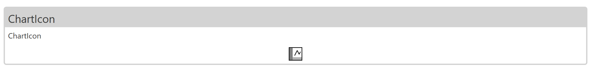
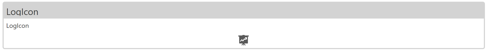
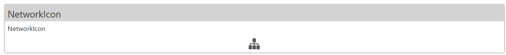
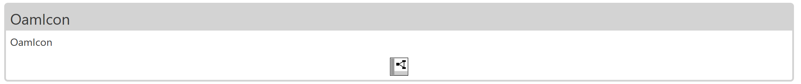
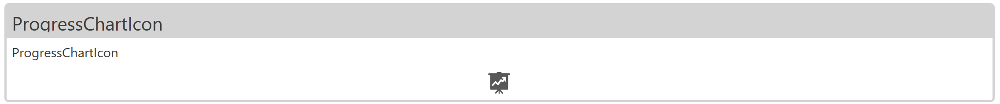
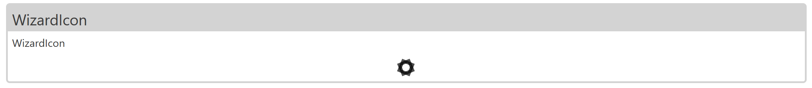

# Summary

- 아이콘 모음입니다.

# ChartIcon

### 컨트롤 목적

- ChartIcon



### 샘플 코드

```xml
<nvicon:ChartIcon />
``` 


# LogIcon

### 컨트롤 목적

-LogIcon



### 샘플 코드

```xml
<nvicon:LogIcon />
``` 


# NetworkIcon

### 컨트롤 목적

-NetworkIcon



### 샘플 코드

```xml
<nvicon:NetworkIcon />
``` 


# OamIcon

### 컨트롤 목적

- OamIcon



## 샘플 코드

```xml
<nvicon:OamIcon />
``` 


# ProgressChartIcon

### 컨트롤 목적

- ProgressChartIcon



### 샘플 코드

```xml
<nvicon:ProgressChartIcon />
``` 


# WizardIcon

### 컨트롤 목적

- WizardIcon



### 샘플 코드

```xml
<nvicon:WizardIcon />
```