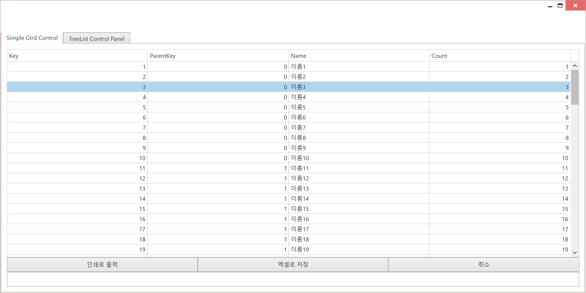
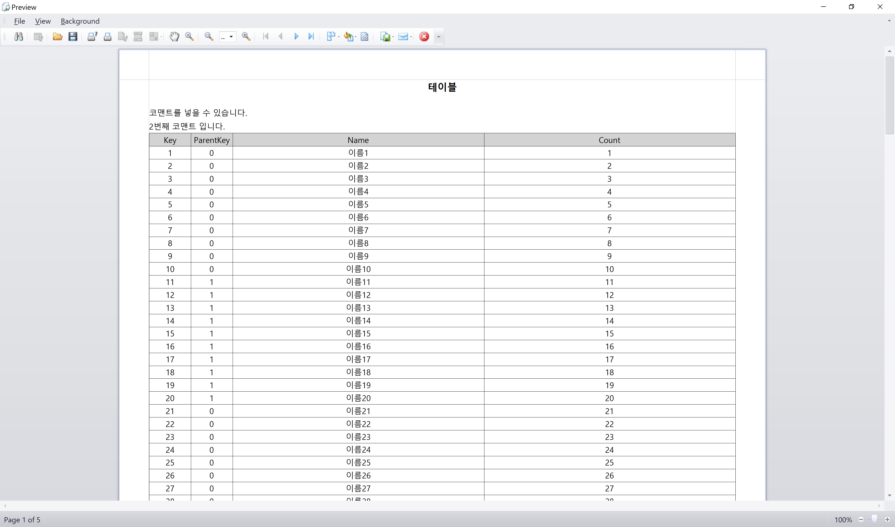
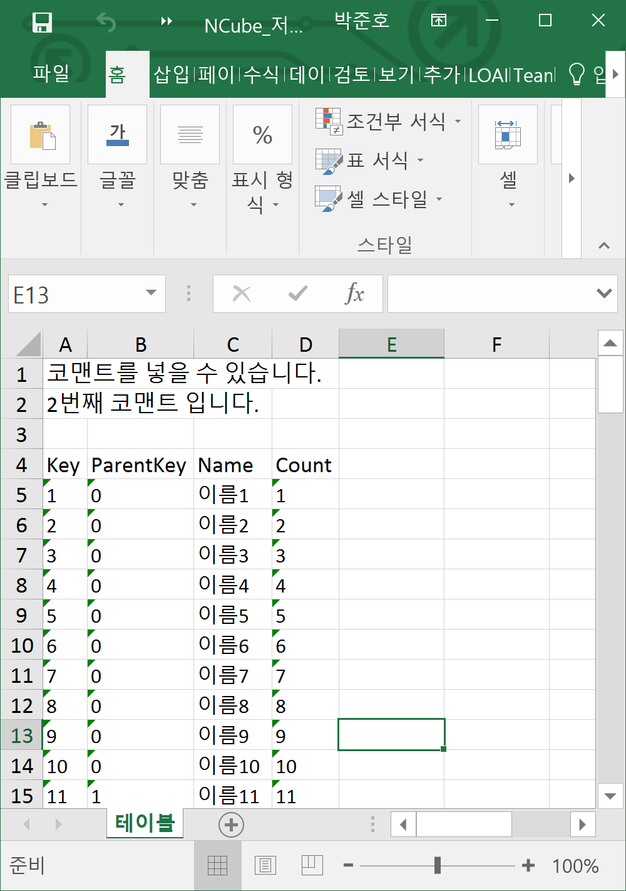
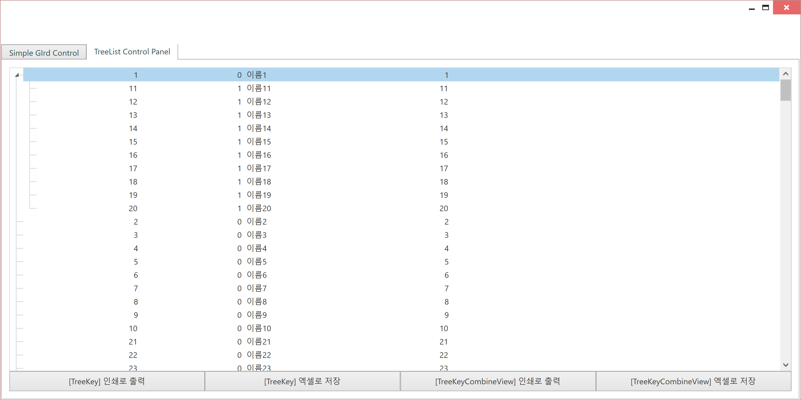
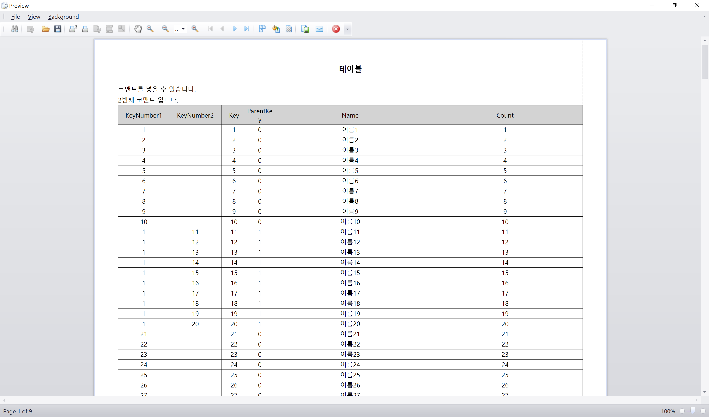
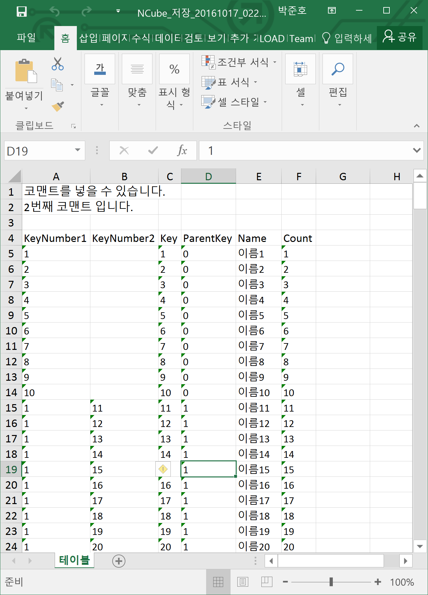
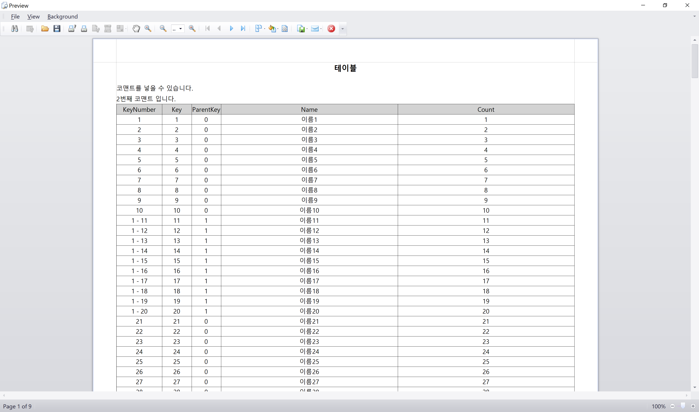
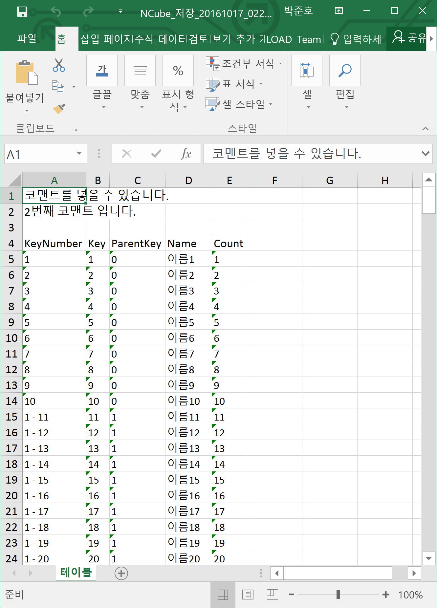

# Summary

- Excel, Print를 출력하기 위한 샘플입니다. GridControl에 바인딩 된 데이터를 Excel이나 Print로 출력합니다.

# SimpleGridControl

## 컨트롤 목적

- 기본적인 GridControl 에서 Report하는 예제입니다.



## Print

- 먼저 테이블을 읽어 hohSheet를 sheetData를 생성합니다.

```cs
// 테이블을 읽어옵니다.
var table = new HohSheetTable(TableSampleModels);
var sheetData = await GetTable(table);

//...

private void GetControl(List<HohSheetModel> hohSheetModles)
{
    var control = new HohSheetControl(GC_Table);
    var img = control.GetImage();
    var imgData = new HohSheetModel(img, "SimpleGridControl")
    {
        PrintOrientation = HohSheetModel.PrintOrientationTypes.Horizontality
    };

    // Data를 추가
    hohSheetModles.Add(imgData);
}
```

- HohReportPrinter를 생성합니다.

```cs
var reportPrinter = new HohReportPrinter();
reportPrinter.Add(sheetData);
```

- 컨트롤 자체를 캡쳐할 경우, 아래와 같은 코드를 이용합니다.

```cs
// 컨트롤을 캡쳐합니다.
var controlList = new List<HohSheetModel>();
GetControl(controlList);
foreach (var hohSheetData in controlList)
{
    reportPrinter.Add(hohSheetData);
}

// ...

private void GetControl(List<HohSheetModel> hohSheetModles)
{
    var control = new HohSheetControl(GC_Table);
    var img = control.GetImage();
    var imgData = new HohSheetModel(img, "SimpleGridControl")
    {
        PrintOrientation = HohSheetModel.PrintOrientationTypes.Horizontality
    };

    // Data를 추가
    hohSheetModles.Add(imgData);
}
```

- 프린트 문서를 생성합니다.

```cs
var createDoc = await reportPrinter.CreateDocumentAsync();
reportPrinter.ShowPreviewDialog();
```

- 결과물



## Excel

- 마찬가지로 먼저 hohSheet를 위한 데이터를 생성합니다.

```cs
var table = new HohSheetTable(TableSampleModels);
var sheetData = await GetTable(table);
```

- 데이터를 넣고, 문서를 생성합니다.

```cs
var spreadSheet = new HohSpreadSheet();
spreadSheet.Add(sheetData);
await spreadSheet.CreateSheetAsync(tokenSrc.Token);
```

- 파일 명을 설정하고, 저장합니다.

```cs
// 파일 이름 지정
string nowStr = DateTime.Now.ToString("yyyyMMdd_HHmmss");
string prefix = "NCube";
string defaultFileName = $"{prefix}_저장_{nowStr}.xlsx";

// 파일 저장
// path의 값이 null일 경우, 저장이 안된 경우입니다.
var path = spreadSheet.SaveDocumentAs(defaultFileName);
```

- 결과물



# AlarmCountControl

## 컨트롤 목적

- TreeKey를 이용하는 GridControl에서 Report하는 예제입니다.



## 샘플 코드

- 이 샘플 프로젝트에서는 Print, ExportExcel 메서드에 어떤 HohSheetTable.TableTypes 을 파라미터로 넘기느냐에 따라 결과물이 다라지도록 구현되어 있습니다.

```xml
<Button Grid.Column="0" Content="[TreeKey] 인쇄로 출력" Click="BTN_Print_OnClick"/>
<Button Grid.Column="1" Content="[TreeKey] 엑셀로 저장" Click="BTN_Excel_OnClick"/>
<Button Grid.Column="2" Content="[TreeKeyCombineView] 인쇄로 출력" Click="BTN_CombineViewPrint_OnClick"/>
<Button Grid.Column="3" Content="[TreeKeyCombineView] 엑셀로 저장" Click="BTN_CombineViewExcel_OnClick"/>
``` 

```cs
private void BTN_Print_OnClick(object sender, RoutedEventArgs e)
{
    this.Print();
}

private void BTN_Excel_OnClick(object sender, RoutedEventArgs e)
{
    this.ExportExcel();
}

private void BTN_CombineViewPrint_OnClick(object sender, RoutedEventArgs e)
{
    this.Print(HohSheetTable.TableTypes.TreeKeyCombineView);
}

private void BTN_CombineViewExcel_OnClick(object sender, RoutedEventArgs e)
{
    this.ExportExcel(HohSheetTable.TableTypes.TreeKeyCombineView);
}
```

- 아래는 실제 동작하는 코드입니다.

```cs
private async Task<HohSheetModel> GetTable(HohSheetTable table)
{
    // 테이블을 정의하고
    // HohSheetModel 데이터를 생성합니다.
    table.AddColumn(new HohColumn
    {
        Header = "Key",
        FieldName = "Key",
        WidthRatio = 0.5,
    });
    table.AddColumn(new HohColumn
    {
        Header = "ParentKey",
        FieldName = "ParentKey",
        WidthRatio = 0.5,
    });
    table.AddColumn(new HohColumn
    {
        Header = "Name",
        FieldName = "Name",
        WidthRatio = 3,
    });
    table.AddColumn(new HohColumn
    {
        Header = "Count",
        FieldName = "Count",
        WidthRatio = 3,
    });

    var source = new CancellationTokenSource();
    _reportCts = source;
    var tableDataTask = table.BuildDataTableAsync(source.Token);
    // 취소 명령
    //await Task.Delay(10);
    //source.Cancel();
    var tableData = await tableDataTask;

    var sheetData = new HohSheetModel(tableData, "테이블")
    {
        PrintOrientation = HohSheetModel.PrintOrientationTypes.Horizontality,
        HeaderComments = new List<string>
        {
            "코맨트를 넣을 수 있습니다.",
            "2번째 코맨트 입니다.",
        }
    };
    return sheetData;
}

public async void Print(HohSheetTable.TableTypes tableType = HohSheetTable.TableTypes.TreeKey)
{
    var treeTable = new HohSheetTable(TableSampleModels,
        tableType,
        treeField: "Key",
        treeHeader: "KeyNumber");
    var sheetData = await GetTable(treeTable);

    var reportPrinter = new HohReportPrinter();
    reportPrinter.Add(sheetData);
    await reportPrinter.CreateDocumentAsync();
    reportPrinter.ShowPreviewDialog();
}

public async void ExportExcel(HohSheetTable.TableTypes tableType = HohSheetTable.TableTypes.TreeKey)
{
    var table = new HohSheetTable(TableSampleModels,
        tableType,
        treeField: "Key",
        treeHeader: "KeyNumber");
    var sheetData = await GetTable(table);

    var spreadSheet = new HohSpreadSheet();
    // Data를 추가합니다.
    spreadSheet.Add(sheetData);

    // 추가된 Data들을 Sheet로 생성합니다. 
    await spreadSheet.CreateSheetAsync();

    // 파일 이름 지정
    string nowStr = DateTime.Now.ToString("yyyyMMdd_HHmmss");
    string prefix = "NCube";
    string defaultFileName = $"{prefix}_저장_{nowStr}.xlsx";

    // 파일 저장
    var path = spreadSheet.SaveDocumentAs(defaultFileName);
    if (path == null)
    {
        // 에러 표시 필요
        return;
    }

    // 저장용 윈도우 Show
    var dialog = new SavedFileOpenWindow(path)
    {
        Message = $"{path} 파일 저장이 완료되었습니다.",
        AlertImage = MessageBoxImage.Information
    };
    dialog.ShowDialog();
}
```

## 결과물

### TreeKey 방식 Print



### TreeKey 방식 Excel



### reeKeyCombineView 방식 Print



### reeKeyCombineView 방식 Excel

